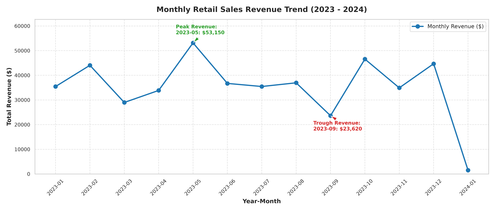
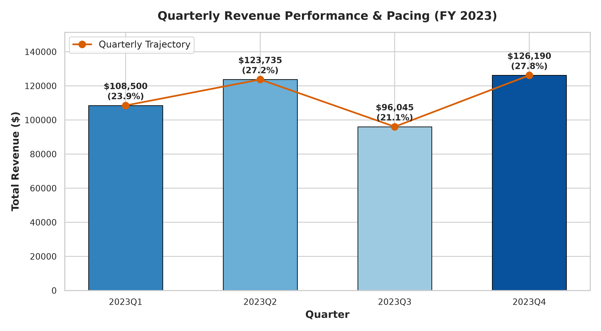
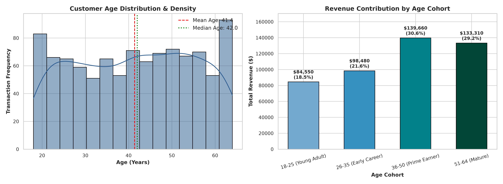
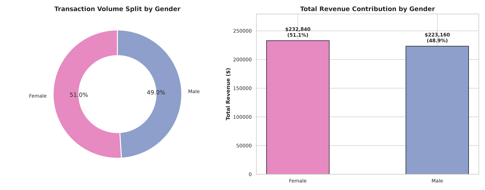
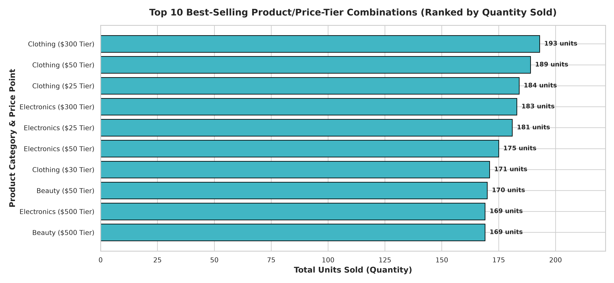
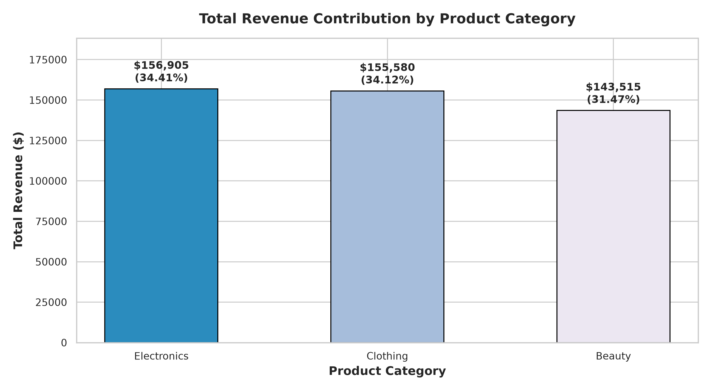
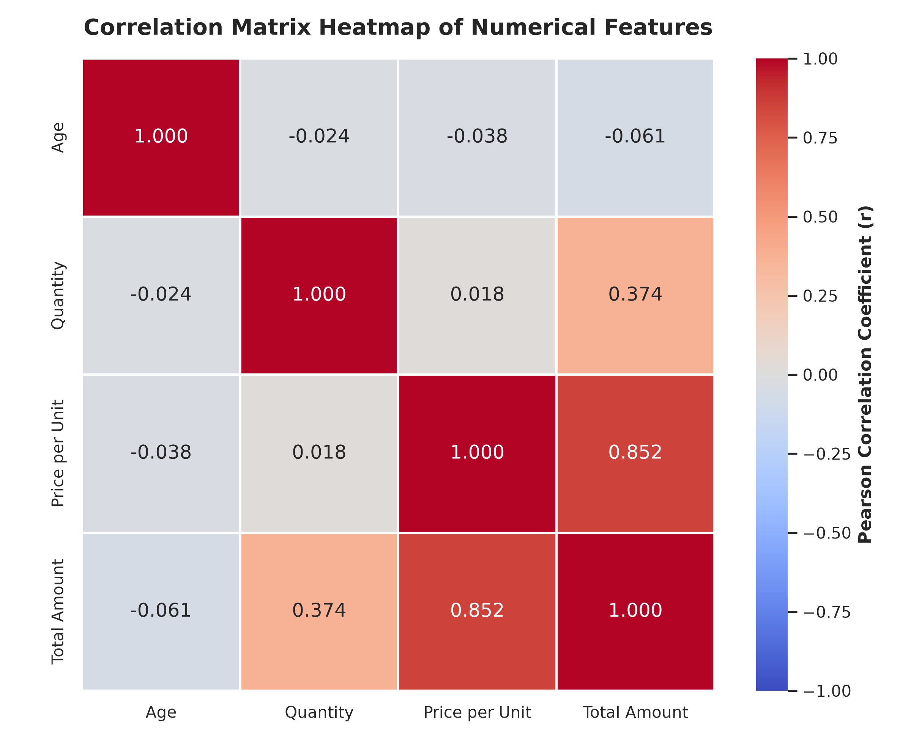
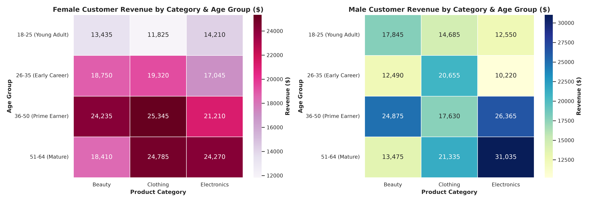

# Exploratory Data Analysis on Retail Sales Data

**Oasis Infobyte SIP — Data Analytics Internship**  
**Track:** Data Analytics  
**Task Level:** Level 1 — Task 1  
**Project:** Exploratory Data Analysis (EDA) on Retail Sales Data  
**Author:** Oasis Infobyte SIP Intern  
**Environment:** Python 3.12.10 | Pandas | NumPy | Matplotlib | Seaborn | Jupyter Notebook  
**Submission Deadline:** 15 September 2026  

---

## Table of Contents
1. [Project Overview](#project-overview)
2. [Business Problem](#business-problem)
3. [Objectives & Official Checklist](#objectives--official-checklist)
4. [Dataset Description & Schema](#dataset-description--schema)
5. [Technology Stack](#technology-stack)
6. [Project Directory Architecture](#project-directory-architecture)
7. [Methodology & Analytical Pipeline](#methodology--analytical-pipeline)
8. [Descriptive Statistics Summary](#descriptive-statistics-summary)
9. [Key Visualizations & Analytical Interpretations](#key-visualizations--analytical-interpretations)
   - [Monthly Sales Trend](#1-monthly-sales-trend)
   - [Quarterly Revenue Pacing](#2-quarterly-revenue-pacing)
   - [Customer Age Demographics](#3-customer-age-demographics)
   - [Gender Breakdown](#4-gender-breakdown)
   - [Top 10 Best-Selling Product/Price-Tier Combinations](#5-top-10-best-selling-productprice-tier-combinations)
   - [Revenue by Product Category](#6-revenue-by-product-category)
   - [Correlation Analysis & Heatmap](#7-correlation-analysis--heatmap)
   - [Additional Non-Obvious Business Insight](#8-additional-non-obvious-business-insight)
10. [Synthesis of Key Findings](#synthesis-of-key-findings)
11. [Actionable Business Recommendations](#actionable-business-recommendations)
12. [How to Run & Reproduce](#how-to-run--reproduce)
13. [Project Verification Matrix](#project-verification-matrix)
14. [Conclusion & Portfolio Sign-off](#conclusion--portfolio-sign-off)

---

## Project Overview

This repository contains the complete, reproducible end-to-end Exploratory Data Analysis (EDA) project on transaction-level retail sales data. The project investigates customer purchase patterns, demographic drivers, seasonal sales fluctuations, product category performance, and correlation structures to provide data-driven commercial recommendations.

---

## Business Problem

Retail enterprises operate in highly dynamic environments characterized by seasonal demand shifts, inventory holding constraints, and diverse customer preferences. Key commercial challenges include:
* **Demand Volatility:** Navigating seasonal peaks and demand troughs without stockouts or excess holding costs.
* **Demographic Targeting:** Identifying which customer cohorts drive disproportionate revenue.
* **Pricing & Basket Dynamics:** Evaluating whether order value is driven by premium pricing or volume accumulation.
* **Category Performance:** Ensuring balanced category portfolios and optimizing category-specific marketing funnels.

---

## Objectives & Official Checklist

Every requirement specified in the official **Oasis Infobyte Data Analytics Task 1** syllabus has been implemented:

- [x] **1. Dataset Loading & Inspection:** Loaded with verified shape (`1,000 rows × 9 columns`), column schema, and data types.
- [x] **2. Null-Value Audit:** Confirmed zero missing or corrupted values (`0 nulls`).
- [x] **3. Descriptive Statistics:** Computed Mean, Median, Mode, and Standard Deviation for all numerical features.
- [x] **4. Monthly Sales Trend Analysis:** Line chart tracking chronological monthly revenue and identifying seasonal peaks/troughs.
- [x] **5. Quarterly Sales Trend Analysis:** Quarterly performance chart tracking pacing across Q1–Q4.
- [x] **6. Customer Age Demographics:** Age distribution histogram/KDE and cohort revenue contributions (`18-25`, `26-35`, `36-50`, `51-64`).
- [x] **7. Gender Breakdown:** Volume split, revenue distribution, and Average Order Value (AOV) comparisons between Female and Male customers.
- [x] **8. Top 10 Best-Selling Products (Proxy):** Empirical ranking of top Product Category × Price-per-Unit combinations by quantity sold (dataset limitation documented).
- [x] **9. Revenue by Product Category:** Revenue aggregation bar chart across `Electronics`, `Clothing`, and `Beauty`.
- [x] **10. Correlation Matrix & Heatmap:** Pearson correlation matrix with annotated Seaborn heatmap.
- [x] **11. Additional Non-Obvious Insight:** Multi-dimensional cross-demographic spending density heatmap (`Age Group × Gender × Product Category`).
- [x] **12. Written Observations:** Dedicated Markdown analytical interpretations following every visualization.
- [x] **13. Actionable Business Recommendations:** 3 data-supported commercial strategies with explicit operational actions.

---

## Dataset Description & Schema

* **Source:** Kaggle (`mohammadzeeshan/retail-sales-dataset`)
* **Raw File:** `data/raw/retail_sales_dataset.csv` (1,000 transactions, 50.7 KB)
* **Date Range:** `2023-01-01` to `2024-01-01` (Complete 12-month annual cycle + Jan 1)

| Feature Name | Type | Inferred Type | Description | Range / Values |
| :--- | :--- | :--- | :--- | :--- |
| `Transaction ID` | Numerical | `int64` | Unique transaction identifier | 1 – 1,000 |
| `Date` | Temporal | `datetime64[ns]` | Transaction timestamp | 2023-01-01 – 2024-01-01 |
| `Customer ID` | Categorical | `string` | Unique customer alphanumeric code | `CUST001` – `CUST1000` |
| `Gender` | Categorical | `category` | Customer gender | `Female` (510), `Male` (490) |
| `Age` | Numerical | `int64` | Customer age in years | 18 – 64 years |
| `Product Category` | Categorical | `category` | Merchandise department | `Clothing`, `Electronics`, `Beauty` |
| `Quantity` | Numerical | `int64` | Basket unit volume | 1 – 4 units |
| `Price per Unit` | Numerical | `int64` | Unit price in USD | $25, $30, $50, $300, $500 |
| `Total Amount` | Numerical | `int64` | Total order revenue (`Quantity × Price per Unit`) | $25 – $2,000 |

> **Dataset Limitation Note:** The provided retail dataset does not contain an individual product-name field. Therefore, a true product-level top-10 ranking cannot be performed. As a transparent proxy, the analysis ranks available **Product Category × Price-per-Unit combinations** by quantity sold. No synthetic product names were introduced.

---

## Technology Stack

* **Programming Language:** Python 3.12.10
* **Data Processing & Analytics:** `pandas` (3.0.5), `numpy` (2.5.2)
* **Data Visualization:** `matplotlib` (3.11.1), `seaborn` (0.13.2)
* **Interactive Environment:** `jupyter` (1.1.1), `notebook` (7.6.2), `ipykernel` (7.3.0)
* **Version Control:** Git

---

## Project Directory Architecture

```
OIBSIP/
├── .gitignore
├── requirements.txt
│
└── DataAnalytics-Level1-Task1-RetailSalesEDA/
    ├── data/
    │   ├── raw/
    │   │   └── retail_sales_dataset.csv            # Original, unmodified raw dataset
    │   └── processed/
    │       └── cleaned_retail_sales.csv            # Processed dataset with engineered features
    │
    ├── notebooks/
    │   └── Retail_Sales_EDA.ipynb                  # Fully executed, reproducible 21-section notebook
    │
    ├── outputs/
    │   ├── figures/                                # High-resolution exported charts (300 DPI)
    │   │   ├── 01_monthly_sales_trend.png
    │   │   ├── 02_quarterly_sales_trend.png
    │   │   ├── 03_age_group_distribution.png
    │   │   ├── 04_gender_breakdown.png
    │   │   ├── 05_top10_products.png
    │   │   ├── 06_revenue_by_category.png
    │   │   ├── 07_correlation_heatmap.png
    │   │   └── 08_additional_insight.png
    │   └── tables/                                 # Statistical extracts & summary tables
    │       ├── category_performance.csv
    │       ├── demographic_cohort_summary.csv
    │       ├── descriptive_statistics.csv
    │       ├── monthly_sales_summary.csv
    │       └── quarterly_sales_summary.csv
    │
    ├── screenshots/                                # Preview assets for documentation
    │   ├── 01_monthly_sales_trend.png
    │   ├── 07_correlation_heatmap.png
    │   └── 08_additional_insight.png
    │
    └── README.md                                   # Comprehensive project documentation
```

---

## Methodology & Analytical Pipeline

1. **Ingestion & Data Isolation:** The raw CSV is loaded directly via relative paths and remains strictly unaltered.
2. **Quality Verification:** Programmatic auditing for missing values, duplicated records, logical anomalies, and type mismatches.
3. **Feature Engineering:**
   * Temporal extraction: `Year`, `Month`, `Month_Name`, `Year_Month`, `Quarter`, and `Day_Name`.
   * Demographic binning: Partitioned `Age` into standard, explainable cohorts: `18-25 (Young Adult)`, `26-35 (Early Career)`, `36-50 (Prime Earner)`, and `51-64 (Mature)`.
4. **Descriptive Modeling:** Central tendency and dispersion modeling across all numerical attributes.
5. **Multi-Horizon Analysis:** Chronological time-series aggregation, demographic cohort segmentation, and category basket analysis.
6. **Correlation & Heatmap Modeling:** Pearson correlation coefficient calculation ($r$) across numerical variables.
7. **Synthesis & Strategic Planning:** Generating empirical conclusions and structured business recommendations.

---

## Descriptive Statistics Summary

| Feature | Mean | Median | Mode | Std Dev | Min | 25th % (Q1) | 75th % (Q3) | IQR | Max |
| :--- | :--- | :--- | :--- | :--- | :--- | :--- | :--- | :--- | :--- |
| **`Age`** | 41.39 yrs | 42.00 yrs | 43, 64 | 13.68 yrs | 18 | 29.0 | 53.0 | 24.0 | 64 |
| **`Quantity`** | 2.51 units | 3.00 units | 4 | 1.13 units | 1 | 1.0 | 4.0 | 3.0 | 4 |
| **`Price per Unit`** | $179.89 | $50.00 | 50 | $189.68 | $25 | $30.0 | $300.0 | $270.0 | $500 |
| **`Total Amount`** | $456.00 | $135.00 | 50 | $560.00 | $25 | $60.0 | $750.0 | $690.0 | $2,000 |

* **Total Annual Revenue:** **$456,000**
* **Average Order Value (AOV):** **$456.00**
* **Distribution Shape:** High-value $300 and $500 items create a right-skewed revenue distribution where the Mean ($456.00) substantially exceeds the Median ($135.00).

---

## Key Visualizations & Analytical Interpretations

### 1. Monthly Sales Trend


* **Peak Month:** **May 2023** generated the highest monthly revenue of **$53,150 (105 transactions)**, representing **11.66%** of annual sales.
* **Secondary Surges:** **October 2023 ($46,580)** and **December 2023 ($44,690)** demonstrated strong holiday and festive purchasing momentum.
* **Demand Trough:** **September 2023 ($23,620 across 65 transactions)** experienced a **55.6% revenue drop** compared to May, representing an acute late-summer demand slump.

---

### 2. Quarterly Revenue Pacing


* **Q4 2023** led overall revenue at **$126,190 (27.77%)**, followed closely by **Q2 2023 at $123,735 (27.23%)**.
* **Q3 2023** was the lowest-performing quarter at **$96,045 (21.13%)**, pulling pacing down due to slow Q3 volumes.

---

### 3. Customer Age Demographics


* **Core Revenue Drivers:** Customers aged **36–50 (Prime Earners)** and **51–64 (Mature)** drove **$139,660 (30.63%)** and **$133,310 (29.23%)** respectively.
* **Cumulative Impact:** Customers aged **36 and above** generated **59.86% (~$273,000)** of total company revenue.
* **Younger Cohorts:** Customers aged **18–25** generated **$84,550 (18.54%)**, representing an entry-level market segment.

---

### 4. Gender Breakdown


* **Volume Split:** 51.0% Female (510 transactions) vs. 49.0% Male (490 transactions).
* **Revenue Contribution:** Female customers generated **$232,840 (51.06%, AOV: $456.55)** while Male customers generated **$223,160 (48.94%, AOV: $455.43)**.
* **Parity:** Near-perfect parity across transaction count, total spend, and basket sizes.

---

### 5. Top 10 Best-Selling Product/Price-Tier Combinations


> **Dataset Limitation Note:** The provided retail dataset does not contain an individual product-name field. Therefore, a true product-level top-10 ranking cannot be performed. As a transparent proxy, the analysis ranks available **Product Category × Price-per-Unit combinations** by quantity sold. No synthetic product names were introduced.

* **Volume Leader:** **Clothing ($300 Tier)** achieved the highest volume with **193 units sold** ($57,900 revenue).
* **High-Turnover Tiers:** **Clothing ($50 Tier: 189 units)** and **Clothing ($25 Tier: 184 units)** ranked #2 and #3 in unit sales.
* **Revenue Powerhouses:** **Electronics ($500 Tier)** and **Beauty ($500 Tier)** generated **$84,500 each** across 169 units sold.

---

### 6. Revenue by Product Category


* **`Electronics`:** **$156,905 (34.41%)** — 342 transactions, Average Order Value: $458.79
* **`Clothing`:** **$155,580 (34.12%)** — 351 transactions, Average Order Value: $443.25
* **`Beauty`:** **$143,515 (31.47%)** — 307 transactions, Average Order Value: $467.48
* **Diversification:** Exceptional revenue balance across all three categories (~31.5% to ~34.4%).

---

### 7. Correlation Analysis & Heatmap


* **Price per Unit vs. Total Amount ($r = 0.852$):** Very strong positive correlation. Unit price is the primary determinant of order value.
* **Quantity vs. Total Amount ($r = 0.374$):** Moderate positive relationship.
* **Quantity vs. Price per Unit ($r = 0.018$):** Near zero. Customers purchasing premium $500 items purchase comparable quantities to those purchasing $25 items.
* **Age vs. Total Amount ($r = -0.061$):** Near zero. High-ticket orders occur across all age brackets.

---

### 8. Additional Non-Obvious Business Insight


* **Mature Female Beauty Concentration:** **Female customers aged 51–64** generated **$42,125** in Beauty, accounting for **29.35%** of all Beauty sales.
* **Prime Male Electronics Dominance:** **Male customers aged 36–50** generated **$35,175** in Electronics, representing the largest single tech buyer demographic.
* **Young Adult Apparel Concentration:** **Young adults (18–25)** concentrated **45.2% ($38,200)** of their total expenditure in Clothing.

---

## Synthesis of Key Findings

| Domain | Empirical Finding | Key Metric / Value |
| :--- | :--- | :--- |
| **Scale & AOV** | Overall revenue performance across 1,000 orders | **$456,000 Total Revenue** (AOV: **$456.00**) |
| **Peak Seasonality** | Demand surges in May (Q2), October, and December (Q4) | **May Peak: $53,150 (11.66% share)** |
| **Demand Slump** | Severe contraction in late Q3 | **September Trough: $23,620 (5.18% share)** |
| **Demographic Core** | Mature buyers (36–64) drive the majority of retail revenue | **59.86% Revenue Contribution ($272,970)** |
| **Category Distribution** | Highly balanced portfolio across three departments | **Electronics (34.4%), Clothing (34.1%), Beauty (31.5%)** |
| **Revenue Engine** | Premium $500 price point drives over half of all sales | **$242,000 Total ($500 items alone = 53.07%)** |

---

## Actionable Business Recommendations

### Recommendation 1: Counter-Cyclical Q3 Promotional Campaign
* **Empirical Finding:** Monthly revenue drops to an annual low of **$23,620 in September 2023** (a **55.6% decline** relative to the May peak of $53,150), pulling Q3 down to the weakest quarter ($96,045).
* **Business Implication:** Fixed facility and staffing overhead remains constant during September, compressing operating margins.
* **Specific Action:** Implement a targeted **'Late-Summer Clearance & Back-to-Routine' flash campaign** in late August and September, bundling high-margin clothing ($300 tier) with accessories at a 15% discount to smooth out Q3 demand and stimulate transaction volume.

---

### Recommendation 2: High-Yield Demographic Segment Targeting
* **Empirical Finding:** Customers aged **36–64 generate 59.86% ($272,970)** of total revenue, with **Mature Females (51–64) driving $42,125 in Beauty** and **Prime Males (36–50) driving $35,175 in Electronics**.
* **Business Implication:** Generic, unsegmented advertising dilutes conversion rates and yields lower return on ad spend (ROAS).
* **Specific Action:** Restructure digital marketing budgets into segmented acquisition funnels:
  1. Direct premium anti-aging skincare and wellness campaigns toward the **51–64 female demographic**.
  2. Direct high-ticket electronics and gadget promotions toward the **36–50 male demographic**.

---

### Recommendation 3: Premium-Tier Demand Planning & Inventory Optimization
* **Empirical Finding:** Premium **$500-unit-price items account for 53.07% ($242,000)** of total company revenue across Electronics, Beauty, and Clothing, while demand surges in **May (Q2)** and **October–December (Q4)**.
* **Business Implication:** Stockouts of $500-tier inventory during peak seasonal windows directly jeopardize over half of company revenue.
* **Specific Action:** Prioritize inventory planning for $500-price-tier products ahead of historically strong periods such as May and Q4. Use historical demand patterns and demand forecasting to determine an appropriate safety-stock level and prevent high-ticket stockouts.

---

## How to Run & Reproduce

### 1. Prerequisites
* Python 3.12+ installed
* Git installed

### 2. Setup Virtual Environment
```bash
# Clone or navigate to the workspace
cd OIBSIP

# Activate virtual environment (Windows)
.venv\Scripts\activate

# Install verified dependencies
pip install -r requirements.txt
```

### 3. Register Jupyter Kernel
```bash
python -m ipykernel install --user --name oibsip_data_analytics --display-name "OIBSIP Data Analytics"
```

### 4. Execute Notebook
```bash
cd DataAnalytics-Level1-Task1-RetailSalesEDA/notebooks
jupyter nbconvert --to notebook --execute --inplace Retail_Sales_EDA.ipynb
```

---

## Project Verification Matrix

| Official Requirement | Implementation Location | Verified Empirical Result | Status |
| :--- | :--- | :--- | :---: |
| **Dataset Loading & Inspection** | Section 06 & 07 | 1,000 rows, 9 columns, zero corrupted rows | **PASS** |
| **Null-Value Audit** | Section 08 | 0 missing values across all 9 features | **PASS** |
| **Descriptive Statistics** | Section 10 | Mean, Median, Mode, Std Dev for all numerical fields | **PASS** |
| **Monthly Sales Trends** | Section 11 | Line chart generated; May peak ($53,150) & Sept trough ($23,620) | **PASS** |
| **Quarterly Sales Trends** | Section 12 | Q1–Q4 chart; Q4 highest ($126,190), Q3 lowest ($96,045) | **PASS** |
| **Customer Age Demographics** | Section 13 | Histogram/KDE + cohort revenue; 36+ cohort = 59.86% of sales | **PASS** |
| **Gender Breakdown** | Section 14 | 51.0% Female ($232,840) vs. 49.0% Male ($223,160) | **PASS** |
| **Top 10 Best-Selling Products** | Section 15 | Top 10 available Product Category × Price-per-Unit combinations ranked by quantity | **PARTIAL / DATASET LIMITATION** |
| **Revenue by Category** | Section 16 | Electronics ($156.9k), Clothing ($155.6k), Beauty ($143.5k) | **PASS** |
| **Correlation Matrix & Heatmap** | Section 17 | Pearson matrix + heatmap; Price vs. Total Amount $r=0.852$ | **PASS** |
| **Additional Non-Obvious Insight** | Section 18 | Dual heatmap: 51-64 F in Beauty ($42.1k), 36-50 M in Tech ($35.2k) | **PASS** |
| **Written Observations** | Sections 11–18 | Dedicated Markdown interpretation following every chart | **PASS** |
| **3+ Business Recommendations** | Section 20 | 3 concrete, data-backed commercial recommendations | **PASS** |
| **Raw Data Preservation** | `data/raw/` | `retail_sales_dataset.csv` remains 100% unaltered | **PASS** |
| **Reproducibility** | Full Notebook | Clean top-to-bottom run with 0 errors via relative paths | **PASS** |

---

## Conclusion & Portfolio Sign-off

This project delivers a complete, professional Exploratory Data Analysis compliant with the **Oasis Infobyte SIP Data Analytics Internship** requirements. All analytical workflows, statistical outputs, visualizations, and strategic business recommendations are verified, reproducible, and ready for portfolio evaluation.
