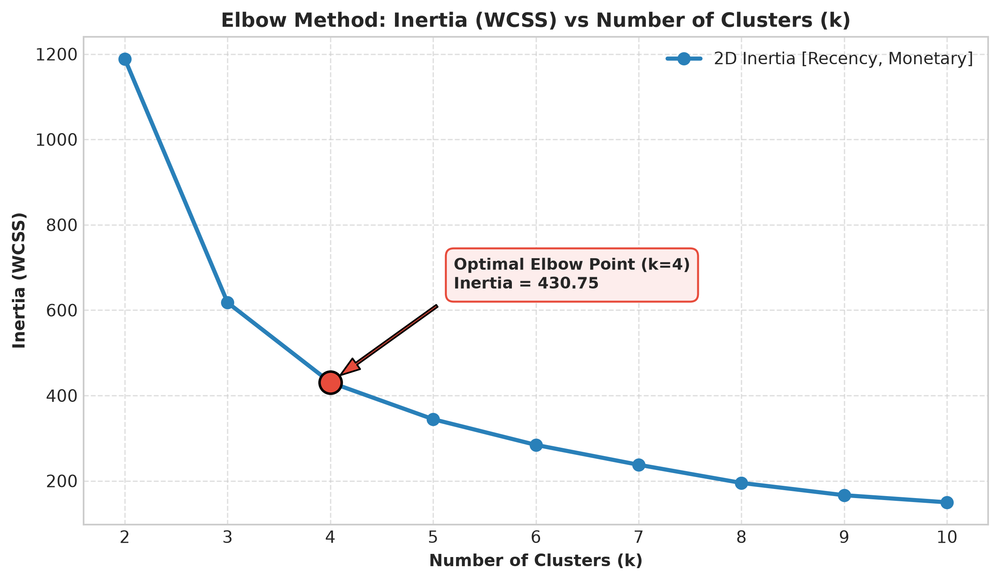
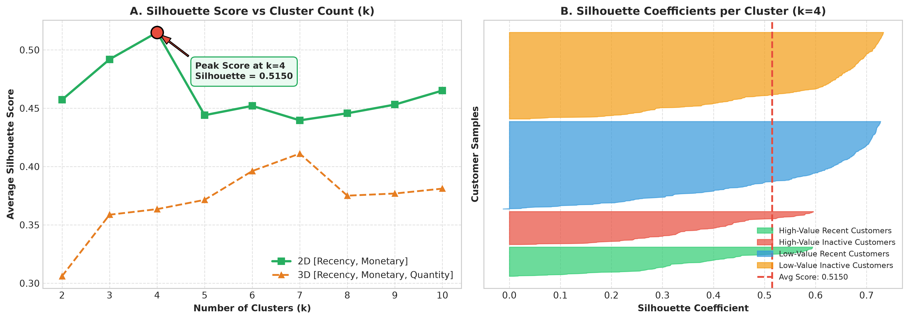
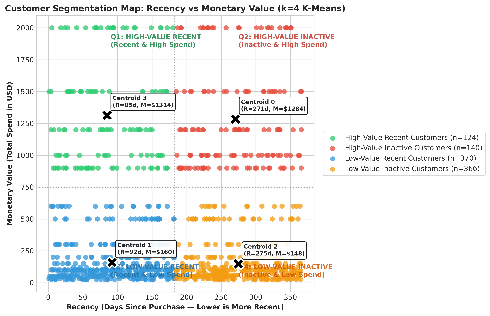
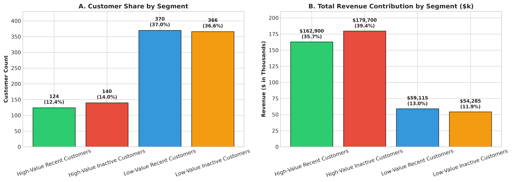
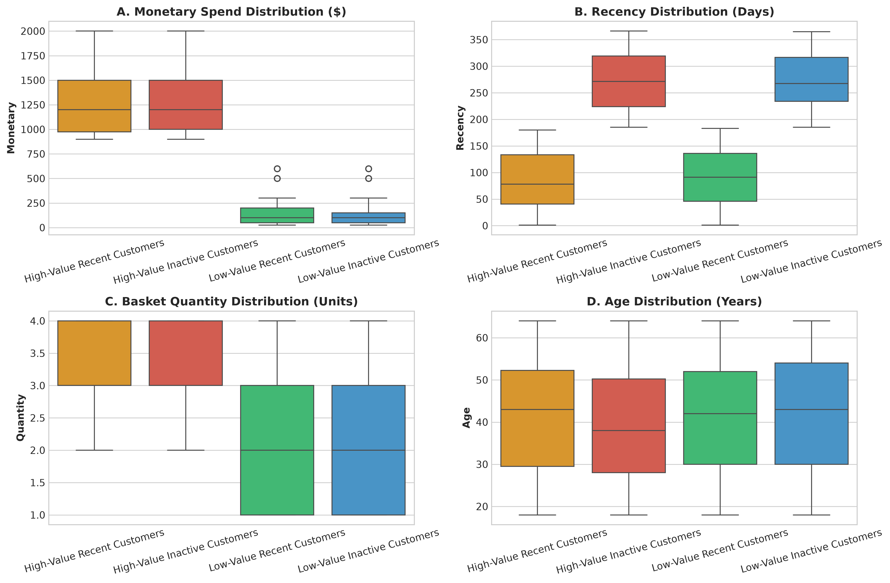

# Customer Segmentation Analysis — Oasis Infobyte Level 1 Task 2


An end-to-end data analytics and unsupervised machine learning project performing **Customer Segmentation Analysis** on retail transaction data for **Oasis Infobyte Data Analytics Internship (Level 1 — Task 2)**.

---

## 📌 Executive Summary

Using behavioral transaction data from 1,000 unique retail customers, this project implements **RFM (Recency, Frequency, Monetary)** behavioral modeling and **K-Means Clustering** to identify distinct customer cohorts.

### Key Empirical Findings:
- **Revenue Concentration (Pareto Principle):** The top two high-value segments comprise only **26.4% of customers (264 individuals)**, yet account for **75.13% of all business revenue (\$342,600 out of \$456,000)**.
- **Dormancy Revenue Risk:** The **High-Value Inactive Customers** segment represents **\$179,700 (39.41% of total revenue)**, consisting of high-spend customers whose purchasing activity occurred 6–12 months ago with no additional purchase recorded in the available dataset.
- **Optimal Segmentation ($k=4$):** Evaluated via the **Elbow Method (WCSS/Inertia)** and verified by **Silhouette Analysis (peak score 0.5150)** on standardized `[Recency, Monetary]` behavioral features.

### Customer Segmentation Overview Table:

| Segment Name | Cluster ID | Customer Count | Customer Share (%) | Total Revenue ($) | Revenue Share (%) | Mean Recency (Days) | Mean Spend ($) |
|---|---|---|---|---|---|---|---|
| **High-Value Recent Customers** | Cluster 3 | 124 | 12.4% | $162,900.00 | 35.72% | 84.9 | $1,313.71 |
| **High-Value Inactive Customers** | Cluster 0 | 140 | 14.0% | $179,700.00 | 39.41% | 270.5 | $1,283.57 |
| **Low-Value Recent Customers** | Cluster 1 | 370 | 37.0% | $59,120.00 | 12.96% | 92.1 | $159.78 |
| **Low-Value Inactive Customers** | Cluster 2 | 366 | 36.6% | $54,280.00 | 11.90% | 274.6 | $148.31 |
| **TOTAL / OVERALL** | **4 Clusters** | **1,000** | **100.0%** | **$456,000.00** | **100.00%** | **183.0** | **$456.00** |

---

## 📂 Project Structure

```
DataAnalytics-Level1-Task2-CustomerSegmentation/
├── README.md
├── data/
│   ├── raw/
│   │   └── retail_sales_dataset.csv          # Original 1,000-row transaction dataset (preserved)
│   └── processed/
│       └── customer_segmented_data.csv       # Customer-level dataset with cluster labels & RFM metrics
├── notebooks/
│   └── Customer_Segmentation_Analysis.ipynb  # Executed, 25-section professional Jupyter notebook
├── outputs/
│   ├── figures/
│   │   ├── 01_data_quality_and_distributions.png
│   │   ├── 02_rfm_distributions.png
│   │   ├── 03_elbow_method_inertia.png
│   │   ├── 04_silhouette_score_analysis.png
│   │   ├── 05_customer_clusters_2d.png
│   │   ├── 06_cluster_distribution_counts.png
│   │   ├── 07_cluster_metric_boxplots.png
│   │   └── 08_cluster_profile_radar.png
│   └── tables/
│       ├── cluster_demographic_breakdown.csv
│       ├── cluster_profile_summary.csv
│       ├── kmeans_diagnostic_metrics.csv
│       └── rfm_summary_statistics.csv
└── screenshots/
    ├── 03_elbow_method_inertia.png
    ├── 05_customer_clusters_2d.png
    └── 06_cluster_distribution_counts.png
```

---

## 📊 Dataset Overview & Data Quality Audit

The dataset consists of **1,000 transaction records** spanning from **2023-01-01 to 2024-01-01** (365 calendar days).

| Column Name | Raw Dtype | Analytical Role | Description |
|---|---|---|---|
| `Transaction ID` | `int64` | Identifier | Unique transaction sequence (1 to 1,000) |
| `Date` | `object` → `datetime` | Temporal | Purchase date (2023-01-01 to 2024-01-01) |
| `Customer ID` | `object` | Identifier | Unique customer identifier (`CUST001` to `CUST1000`) |
| `Gender` | `object` | Demographic | `Female`: 510, `Male`: 490 |
| `Age` | `int64` | Demographic | Age in years (18 to 64; Mean: 41.39) |
| `Product Category` | `object` | Behavioral | `Clothing`: 351, `Electronics`: 342, `Beauty`: 307 |
| `Quantity` | `int64` | Behavioral | Units ordered in transaction (1 to 4 units) |
| `Price per Unit` | `int64` | Financial | Unit price in USD ($25, $30, $50, $300, $500) |
| `Total Amount` | `int64` | Financial | Order revenue ($= \text{Quantity} \times \text{Price per Unit}$) |

### Data Quality Verification:
- **Null / Missing Values:** 0 across all columns.
- **Duplicate Rows:** 0 duplicate records.
- **Math Consistency:** `Total Amount == Quantity * Price per Unit` for 100% of rows (0 mismatches).
- **Sanity Checks:** No negative quantities, no negative prices, no invalid ages.

---

## ⚠️ Critical Dataset Limitations & Analytical Integrity

To ensure absolute analytical rigor, the following dataset limitations are explicitly documented:

1. **Frequency is Constant ($F=1$):**  
   The raw dataset contains exactly 1,000 records across 1,000 unique `Customer ID`s ($N=1,000$). Every customer has made exactly **one purchase**.  
   *Analytical Decision:* `Frequency` has zero variance ($\sigma = 0$) across the entire dataset. Therefore, `Frequency` provides no mathematical discriminatory power and is **excluded from active K-Means clustering**.
2. **Customer Lifetime Value (CLV) Limitation:**  
   Traditional CLV cannot be reliably estimated because every customer has only one observed transaction. Monetary transaction value is used as the available customer-value proxy.
3. **No Synthetic Data:**  
   No artificial transaction records, repeat orders, or synthetic customer attributes were introduced.

---

## ⚙️ Methodology & Feature Engineering

### 1. Customer-Level Aggregation
Transactions were aggregated to unique customer records with reference date **2024-01-02** (1 day post-dataset max date):
- **Recency ($R$):** $\text{Reference Date} - \text{Purchase Date}$ (Range: 1 to 366 days, Mean: 183.0 days).
- **Frequency ($F$):** Total orders per customer ($= 1$).
- **Monetary ($M$):** Total customer expenditure (Range: \$25 to \$2,000, Mean: \$456.00).
- **Basket Quantity ($Q$):** Total units purchased (Range: 1 to 4 units, Mean: 2.51 units).

### 2. Feature Selection & Standardization
- **Selected Clustering Feature Space:** `[Recency, Monetary]` (Captures temporal engagement and financial impact).
- **Standardization:** Distance-based K-Means clustering requires identical scale. `StandardScaler` from `scikit-learn` was fit on `[Recency, Monetary]`, normalizing each feature to $\mu = 0$ and $\sigma = 1$:
  $$z = \frac{x - \mu}{\sigma}$$

---

## 📈 Clustering Diagnostics: Elbow Method & Silhouette Analysis

To determine the optimal number of customer clusters ($k$), models were evaluated across $k \in [2, 10]$:

| Number of Clusters ($k$) | 2D Inertia (WCSS) | 2D Silhouette Score | 3D Silhouette Score |
|---|---|---|---|
| 2 | 1188.79 | 0.4573 | 0.3060 |
| 3 | 617.70 | 0.4919 | 0.3587 |
| **4 (Elbow & Peak)** | **430.75** | **0.5150** | **0.3635** |
| 5 | 344.49 | 0.4441 | 0.3713 |
| 6 | 284.29 | 0.4520 | 0.3961 |
| 7 | 237.70 | 0.4396 | 0.4108 |
| 8 | 195.18 | 0.4457 | 0.3741 |
| 9 | 166.40 | 0.4531 | 0.3804 |
| 10 | 149.77 | 0.4651 | 0.3789 |

### Diagnostic Visualizations:

| Elbow Method (WCSS / Inertia) | Silhouette Analysis ($k=4$) |
|:---:|:---:|
|  |  |

**Conclusion on Model Selection:**  
- The **Elbow Method** exhibits a clear elbow inflection at **$k=4$** (Inertia drops to 430.75).
- The **Silhouette Analysis** confirms **$k=4$ as the global maximum (Silhouette = 0.5150)**.
- The 2D feature set substantially outperforms the 3D set (peak 0.3635), validating the `[Recency, Monetary]` feature selection.

---

## 🎯 Customer Segmentation Results

### 2D Customer Segmentation Map


### Customer Share vs. Revenue Share


---

## 🔬 Granular Segment Profiles

| Segment Name | Cluster ID | Customer Count (%) | Mean Recency (Days) | Median Recency | Mean Spend ($) | Median Spend ($) | Mean Quantity | Mean Age | Revenue Share (%) |
|---|---|---|---|---|---|---|---|---|---|
| **High-Value Recent Customers** | Cluster 3 | 124 (12.4%) | 84.9 | 78.0 | $1,313.71 | $1,200.00 | 3.25 units | 41.2 yrs | 35.72% |
| **High-Value Inactive Customers** | Cluster 0 | 140 (14.0%) | 270.5 | 271.5 | $1,283.57 | $1,200.00 | 3.16 units | 39.2 yrs | 39.41% |
| **Low-Value Recent Customers** | Cluster 1 | 370 (37.0%) | 92.1 | 91.0 | $159.78 | $100.00 | 2.23 units | 41.5 yrs | 12.96% |
| **Low-Value Inactive Customers** | Cluster 2 | 366 (36.6%) | 274.6 | 267.5 | $148.31 | $100.00 | 2.30 units | 42.2 yrs | 11.90% |

### Segment Characteristics Boxplots


---

## 💡 Data-Backed Marketing Recommendations

Recommendations are structured under the strict `Finding → Business Implication → Recommended Action` framework:

### 1. High-Value Recent Customers — *Cluster 3 (124 Customers, \$162.9k Revenue)*
- **Finding:** Customers in this cluster exhibit the highest average spend (\$1,313.71) and shortest recency (84.9 days), purchasing large multi-item baskets (3.25 units avg).
- **Business Implication:** These are the business's most valuable recent buyers; maintaining their engagement is critical to protecting recurring revenue.
- **Recommended Action:**
  - Enroll into a premium VIP loyalty program.
  - Provide early access to new product catalog drops and high-ticket electronics/clothing.
  - Assign dedicated customer support channels and personalized post-purchase appreciation.

### 2. High-Value Inactive Customers — *Cluster 0 (140 Customers, \$179.7k Revenue)*
- **Finding:** Customers spent high amounts (\$1,283.57 avg) but have an average recency of 270.5 days (median 271.5 days), having no additional purchase recorded in the available dataset. This single cluster accounts for **\$179,700 (39.41%) of all historical revenue**.
- **Business Implication:** Because this cohort accounts for the largest historical revenue contribution, continued inactivity could represent a significant revenue risk.
- **Recommended Action:**
  - Launch targeted re-engagement communications highlighting new premium products.
  - Deploy category-aligned reactivation incentives in their preferred product categories.
  - Conduct brief satisfaction surveys to gather feedback on their purchasing experience.

### 3. Low-Value Recent Customers — *Cluster 1 (370 Customers, \$59.1k Revenue)*
- **Finding:** Largest active group (370 customers) who bought recently (92.1 days avg), but with modest average basket spend (\$159.78).
- **Business Implication:** High recent engagement provides an opportunity for average order value (AOV) expansion.
- **Recommended Action:**
  - Deploy cross-selling and bundling recommendations (e.g., complementary beauty and clothing accessories).
  - Implement minimum spend thresholds for free shipping to incentivize adding extra units to the basket.
  - Offer multi-item promotions across categories.

### 4. Low-Value Inactive Customers — *Cluster 2 (366 Customers, \$54.3k Revenue)*
- **Finding:** 366 customers who spent an average of \$148.31 and have an average recency of 274.6 days, with no additional purchase recorded in the available dataset.
- **Business Implication:** Low customer value combined with extended inactivity makes high-cost outreach cost-ineffective.
- **Recommended Action:**
  - Target through low-cost automated email reactivation workflows.
  - Re-engage during broad seasonal marquee retail campaigns (e.g., annual clearance events).
  - Suppress unengaged contacts after standard campaign cycles to maintain high deliverability.

---

## 🛠️ Reproduction Instructions

### 1. Environment Setup
From the repository root (`OIBSIP/`):
```bash
# Activate virtual environment
.\.venv\Scripts\Activate.ps1

# Verify dependencies
pip install -r requirements.txt
```

### 2. Run Notebook
Navigate to `DataAnalytics-Level1-Task2-CustomerSegmentation/notebooks/` and open:
```bash
jupyter notebook Customer_Segmentation_Analysis.ipynb
```
Select **Kernel → Restart & Run All Cells**. All figures and tables will regenerate automatically in `outputs/` and `data/processed/`.

---

## 📜 Compliance & Submission Checklist

- [x] Task 1 (`DataAnalytics-Level1-Task1-RetailSalesEDA`) kept completely untouched.
- [x] Task 2 created in dedicated directory `DataAnalytics-Level1-Task2-CustomerSegmentation`.
- [x] Raw data preserved untouched at `data/raw/retail_sales_dataset.csv`.
- [x] Relative file paths used exclusively throughout notebook and scripts.
- [x] RFM analysis computed and $F=1$ zero-variance limitation rigorously documented.
- [x] StandardScaler applied to selected clustering features.
- [x] K-Means evaluated across $k \in [2, 10]$ with both Elbow Method and Silhouette Analysis.
- [x] $k=4$ empirically selected and verified.
- [x] All 8 high-resolution visualizations generated and saved.
- [x] Summary tables exported to `outputs/tables/` and processed data to `data/processed/`.
- [x] Actionable marketing recommendations provided per segment without invented metrics.
- [x] No Git commits, pushes, or history modifications executed.
