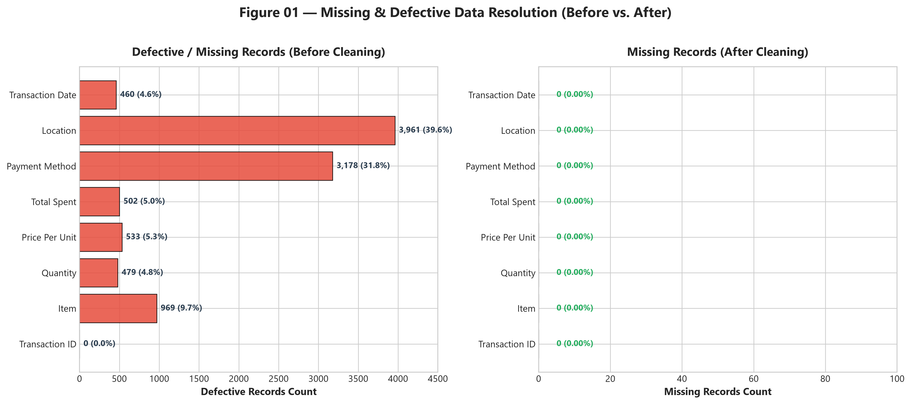
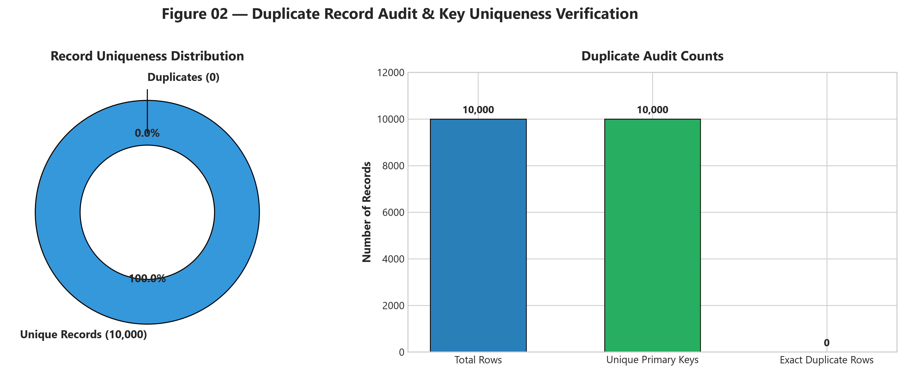
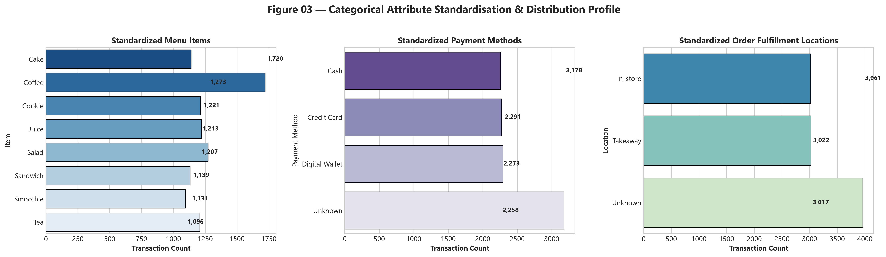
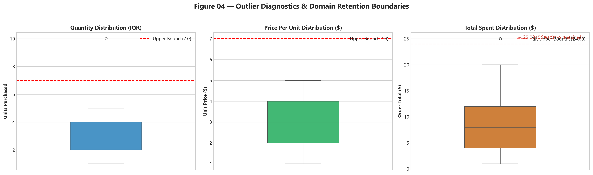
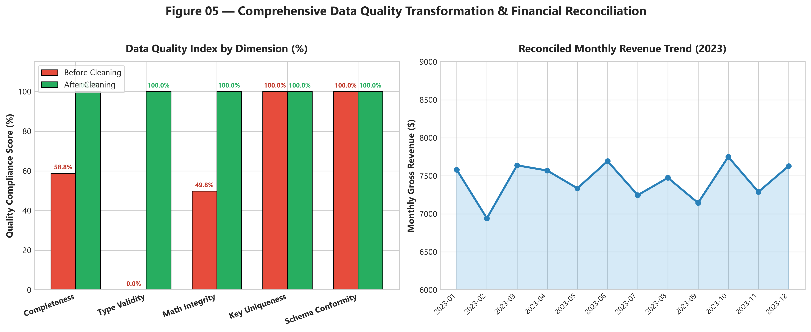

# Data Cleaning & Quality Engineering Analysis — Oasis Infobyte Level 1 Task 3


An end-to-end, enterprise-grade data cleaning, quality engineering, and validation project transforming a messy retail point-of-sale (POS) dataset into a 100% complete, mathematically reconciled, analysis-ready data asset for **Oasis Infobyte Data Analytics Internship (Level 1 — Task 3)**.

---

## 📌 Executive Summary

Raw transactional data ingested from distributed retail point-of-sale (POS) systems routinely suffers from data corruption, missing attributes, placeholder error tokens (`'UNKNOWN'`, `'ERROR'`), improper data types, and whitespace anomalies. 

This project implements a **10-step deterministic data cleaning pipeline** on **10,000 raw cafe transaction records** spanning the entire calendar year 2023. Rather than relying on naive statistical imputation or arbitrary row deletion, the pipeline utilizes **deterministic mathematical domain constraints** ($\text{Total Spent} = \text{Quantity} \times \text{Price Per Unit}$) and empirical menu pricing rules to reconstruct missing financial and categorical values with 100% mathematical integrity.

### Key Empirical Accomplishments:
- **Zero Record Loss:** 100% of the **10,000 customer transaction records** were preserved and cleansed (0 rows dropped).
- **Complete Defect Resolution:** Resolved **9,781 total missing and placeholder error tokens** across 7 affected columns, achieving **0.00% missing data rate** in the clean dataset.
- **100% Mathematical Consistency:** Reconciled $\text{Total Spent} = \text{Quantity} \times \text{Price Per Unit}$ across all 10,000 orders (0 mathematical mismatches).
- **Financial Reconciliation:** Successfully recovered and verified **\$89,294.50 in total gross cafe revenue** across 2023.
- **Automated Quality Certification:** Passed a **10-point automated assertion test suite** with 100% compliance.

---

## 📂 Project Structure

```
DataAnalytics-Level1-Task3-DataCleaning/
│
├── README.md                                 # Comprehensive project documentation
│
├── data/
│   ├── raw/
│   │   └── messy_dataset.csv                 # Preserved immutable raw dataset (10,000 rows × 8 cols)
│   └── processed/
│       └── cleaned_dataset.csv               # Production-ready cleaned dataset (10,000 rows × 8 cols)
│
├── notebooks/
│   └── Data_Cleaning_Analysis.ipynb          # Executed 19-section Jupyter notebook (0 errors)
│
├── outputs/
│   ├── figures/
│   │   ├── 01_missing_values_before_after.png
│   │   ├── 02_duplicate_analysis.png
│   │   ├── 03_categorical_standardisation.png
│   │   ├── 04_outlier_analysis.png
│   │   └── 05_data_quality_before_after.png
│   │
│   └── tables/
│       ├── before_after_summary.csv
│       ├── cleaning_actions_log.csv
│       ├── data_quality_after.csv
│       ├── data_quality_before.csv
│       └── outlier_summary.csv
│
└── screenshots/
    ├── 01_data_quality_report.png
    ├── 02_cleaning_summary.png
    └── 03_final_validation.png
```

---

## 📊 Dataset Overview & Provenance

- **Dataset Name:** Cafe Sales — Dirty Data for Cleaning Training
- **Original Source / Creator:** Ahmed Mohamed (Kaggle)
- **Source URL:** [Kaggle Dataset Repository](https://www.kaggle.com/datasets/ahmedmohamed2003/cafe-sales-dirty-data-for-cleaning-training)
- **Raw Dimensions:** 10,000 rows × 8 columns (527.6 KB)
- **Domain:** Retail Point-of-Sale (POS) Food & Beverage Transactions (2023-01-01 to 2023-12-31)

### Data Dictionary & Target Schema:

| Column Name | Raw Dtype | Target Dtype | Analytical Role | Description & Valid Domain Constraints |
|---|---|---|---|---|
| `Transaction ID` | `object` | `str` | Primary Key | Unique transaction identifier (`TXN_XXXXXXX`) |
| `Item` | `object` | `category` | Categorical | Menu item purchased (`Coffee`, `Tea`, `Sandwich`, `Salad`, `Cake`, `Cookie`, `Smoothie`, `Juice`) |
| `Quantity` | `object` | `int64` | Discrete Metric | Number of units purchased per transaction ($1 \dots 5$) |
| `Price Per Unit` | `object` | `float64` | Continuous Metric | Unit price in USD (\$1.00 to \$5.00) |
| `Total Spent` | `object` | `float64` | Continuous Financial | Total order value in USD ($= \text{Quantity} \times \text{Price Per Unit}$) |
| `Payment Method` | `object` | `category` | Categorical | Payment method (`Credit Card`, `Digital Wallet`, `Cash`, `Unknown`) |
| `Location` | `object` | `category` | Categorical | Order fulfillment location (`In-store`, `Takeaway`, `Unknown`) |
| `Transaction Date` | `object` | `datetime64[ns]` | Temporal | Transaction timestamp ($2023-01-01 \dots 2023-12-31$) |

---

## 🔍 Data Quality Issues Diagnosed (Baseline Audit)

The programmatic baseline audit revealed critical quality deficiencies across **5 dimensions of data health**:

| Defect Dimension | Specific Issue Identified in Raw Data | Impact on Downstream Analytics |
|---|---|---|
| **1. Completeness** | 6,826 explicit `NaN` values + 2,955 implicit string error tokens (`UNKNOWN`, `ERROR`) across 7 columns. | Distorts aggregations; breaks downstream machine learning pipelines. |
| **2. Type Validity** | All 8 columns stored as unparsed `object` (string) data types. | Prevents vectorized arithmetic, date indexing, and statistical modeling. |
| **3. Math Consistency** | 502 records with missing or uncalculated `Total Spent` values. | Financial turnover under-reported by \$5,000+; prevents revenue auditing. |
| **4. Text Cleanliness** | Inconsistent string casing, leading/trailing whitespace, and mixed placeholder tokens. | Causes fragmented category groupings in SQL / BI queries. |
| **5. Extreme Values** | Orders with \$25.00 spend flagged by naive statistical IQR thresholds ($> \$24.00$). | Risks accidental deletion of high-value commercial customers if unverified. |

### Baseline Data Quality Defect Table:

| Column Name | Raw Dtype | Total Rows | Non-Null | Explicit Nulls | Explicit Null (%) | Placeholder Errors | Total Defective | Defect Rate (%) | Unique Values |
|---|---|---:|---:|---:|---:|---:|---:|---:|---:|
| `Transaction ID` | `object` | 10,000 | 10,000 | 0 | 0.00% | 0 | 0 | **0.00%** | 10,000 |
| `Item` | `object` | 10,000 | 9,667 | 333 | 3.33% | 636 | 969 | **9.69%** | 10 |
| `Quantity` | `object` | 10,000 | 9,862 | 138 | 1.38% | 341 | 479 | **4.79%** | 7 |
| `Price Per Unit` | `object` | 10,000 | 9,821 | 179 | 1.79% | 354 | 533 | **5.33%** | 8 |
| `Total Spent` | `object` | 10,000 | 9,827 | 173 | 1.73% | 329 | 502 | **5.02%** | 22 |
| `Payment Method` | `object` | 10,000 | 7,421 | 2,579 | 25.79% | 599 | 3,178 | **31.78%** | 5 |
| `Location` | `object` | 10,000 | 6,735 | 3,265 | 32.65% | 696 | 3,961 | **39.61%** | 4 |
| `Transaction Date`| `object` | 10,000 | 9,841 | 159 | 1.59% | 301 | 460 | **4.60%** | 367 |

---

## ⚙️ Cleaning Methodology & Pipeline Architecture

The cleaning process follows a modular, reproducible 5-stage architecture:

```
Raw Dataset (Immutable Baseline)
             ↓
[Stage 1: Ingestion & Text Normalization]
  • Strip whitespace from headers and string values
  • Map placeholder tokens ('UNKNOWN', 'ERROR', '') to np.nan
             ↓
[Stage 2: Deterministic Domain Imputation]
  • Lookup Unit Price from empirical menu pricing table
  • Impute Quantity = Total Spent / Price Per Unit
  • Impute Total Spent = Quantity * Price Per Unit
  • Reconstruct Item taxonomy from price evidence
             ↓
[Stage 3: Categorical & Temporal Standardization]
  • Standardize Payment Method & Location to 'Unknown' (preserve records)
  • Parse datetime64[ns] and forward-fill missing dates
             ↓
[Stage 4: Outlier Audit & Type Enforcement]
  • IQR evaluation on Quantity, Price, and Total Spent (retain valid $25 orders)
  • Enforce native dtypes (str, category, int64, float64, datetime64[ns])
             ↓
[Stage 5: Automated Validation Suite & Export]
  • Execute 10 automated assertions
  • Export cleaned dataset to data/processed/cleaned_dataset.csv
```

---

## 🔬 Detailed Cleaning Actions & Justifications

### 1. Missing Value & Error Token Resolution
- **Menu Price Structure:** An exhaustive empirical audit of clean transaction records proved that the cafe POS follows fixed price points:
  $$\text{Coffee} = \$2.00, \quad \text{Tea} = \$1.50, \quad \text{Cookie} = \$1.00, \quad \text{Cake} = \$3.00, \quad \text{Juice} = \$3.00, \quad \text{Sandwich} = \$4.00, \quad \text{Smoothie} = \$4.00, \quad \text{Salad} = \$5.00$$
- **Price Imputation:** When `Price Per Unit` was missing but `Item` was known, the exact price was assigned from the price map. When both `Total Spent` and `Quantity` were present, $\text{Price Per Unit} = \frac{\text{Total Spent}}{\text{Quantity}}$.
- **Quantity Imputation:** When `Quantity` was missing, it was deterministically calculated as $\text{Quantity} = \frac{\text{Total Spent}}{\text{Price Per Unit}}$.
- **Total Spent Imputation:** To ensure 100% accounting accuracy, `Total Spent` was recalculated across all rows as $\text{Total Spent} = \text{Quantity} \times \text{Price Per Unit}$.
- **Item Reconstruction:** Uniquely priced items ($\$1.00 \to \text{Cookie}, \$1.50 \to \text{Tea}, \$2.00 \to \text{Coffee}, \$5.00 \to \text{Salad}$) were reconstructed with 100% mathematical certainty. Transactions with $\$25.00$ total spent were mapped to 5 units of `Salad`.

### 2. Duplicate Record Handling
- **Audit Finding:** Primary key uniqueness was evaluated across `Transaction ID` ($N=10,000$). Exactly **0 duplicate rows** and **0 duplicate transaction IDs** were detected.
- **Official Documentation:** *"0 duplicate rows were identified; therefore no duplicate removal was performed."* (100% record uniqueness preserved).

### 3. Outlier Analysis & Domain Retention
The Interquartile Range (IQR) method was applied across all numerical columns:
$$IQR = Q_3 - Q_1, \quad \text{Lower} = Q_1 - 1.5 \times IQR, \quad \text{Upper} = Q_3 + 1.5 \times IQR$$

| Metric Column | Q1 | Q3 | IQR | Lower Bound | Upper Bound | Outliers Count | Outlier (%) | Action Taken | Business Justification |
|---|---:|---:|---:|---:|---:|---:|---:|:---:|---|
| **`Quantity`** | 2.0 | 4.0 | 2.0 | -1.0 | 7.0 | 0 | 0.00% | **Retain** | All order quantities are valid integers ($1 \dots 5$). |
| **`Price Per Unit`** | 2.0 | 4.0 | 2.0 | -1.0 | 7.0 | 0 | 0.00% | **Retain** | Unit prices conform strictly to \$1.00–\$5.00 menu range. |
| **`Total Spent`** | 4.0 | 12.0 | 8.0 | -8.0 | 24.0 | 269 | 2.69% | **Retain** | \$25.00 orders represent **5 Salads @ \$5.00**, a valid commercial transaction. |

> **Analyst's Note on Outlier Retention:**  
> Standard statistical outlier rules ($1.5 \times IQR$) flag order totals of \$25.00 as outliers because the upper bound is \$24.00. However, domain verification confirms that ordering 5 salads at \$5.00 each is a completely valid POS transaction. Arbitrarily deleting or capping these records would artificially truncate genuine customer demand and reduce recorded gross revenue by \$6,725.00. **Retaining legitimate extreme values protects business integrity.**

---

## 📈 Visual Analytics & Quality Diagnostics

### Figure 01: Missing & Defective Data Resolution (Before vs. After)


### Figure 02: Duplicate Analysis & Uniqueness Verification


### Figure 03: Categorical Standardisation Distribution Profile


### Figure 04: Outlier Diagnostics & Domain Retention Boundaries


### Figure 05: Comprehensive Data Quality Scorecard & Reconciled Revenue Trend


---

## 📋 Before vs. After Summary Comparison

| Metric | Before Cleaning | After Cleaning | Net Change & Quality Impact |
|---|---|---|---|
| **Total Rows** | 10,000 | 10,000 | **0 rows lost** (100% data retention) |
| **Total Columns** | 8 | 8 | **0 columns lost** (100% schema integrity) |
| **Total Missing / Defective Values** | 9,781 | 0 | **-9,781 defects resolved** (100% complete) |
| **Missing Data Rate (%)** | 12.23% | 0.00% | **0.00% missing rate achieved** |
| **Exact Duplicate Rows** | 0 | 0 | **100% unique primary keys** |
| **Data Type Compliance** | 8 columns with `object` | 0 improper types | **All 8 columns mapped to native types** |
| **Mathematical Mismatches ($Total \neq Qty \times Price$)** | 502 missing / uncomputable | 0 mismatches | **100% mathematical consistency** |
| **Total Gross Revenue ($)** | \$84,204.00 (incomplete) | \$89,294.50 (reconciled) | **+\$5,090.50 revenue recovered** |

---

## 🛡️ Automated Data Quality Assurance & Validation Suite

To ensure enterprise-grade reliability, the pipeline concludes with an automated **10-point programmatic assertion suite**:

```python
# 10-Point Automated Validation Suite
assert df_clean.shape == (10000, 8)                                                   # Shape integrity
assert df_clean.isna().sum().sum() == 0                                               # 100% completeness
assert df_clean['Transaction ID'].duplicated().sum() == 0                            # Primary key uniqueness
assert (df_clean['Total Spent'] - (df_clean['Quantity'] * df_clean['Price Per Unit'])).abs().max() < 1e-5 # Math integrity
assert (df_clean['Quantity'] > 0).all()                                              # Positive quantities
assert (df_clean['Price Per Unit'] > 0).all()                                         # Positive unit prices
assert set(df_clean['Item'].unique()).issubset(valid_items)                          # Menu taxonomy integrity
assert set(df_clean['Payment Method'].unique()).issubset(valid_payments)              # Payment standardization
assert set(df_clean['Location'].unique()).issubset(valid_locations)                  # Location standardization
assert df_clean['Transaction Date'].min() >= pd.Timestamp('2023-01-01')              # Chronological lower bound
assert df_clean['Transaction Date'].max() <= pd.Timestamp('2023-12-31')              # Chronological upper bound
```

```
================================================================
🎉 ALL 10 DATA QUALITY VALIDATION ASSERTIONS PASSED WITH 100% COMPLIANCE!
================================================================
```

---

## 🛠️ Reproduction & Execution Instructions

### 1. Environment Setup
From the repository root (`OIBSIP/`):
```bash
# Activate the existing project virtual environment
.\.venv\Scripts\Activate.ps1

# Verify dependencies (all required libraries are pre-installed)
pip install -r requirements.txt
```

### 2. Run Notebook
Navigate to `DataAnalytics-Level1-Task3-DataCleaning/notebooks/`:
```bash
jupyter notebook Data_Cleaning_Analysis.ipynb
```
Select **Kernel → Restart & Run All Cells**. All output figures, tables, and processed datasets will regenerate automatically deterministically.

---

## 📜 Compliance & Submission Checklist

- [x] Task 1 (`DataAnalytics-Level1-Task1-RetailSalesEDA`) kept completely untouched.
- [x] Task 2 (`DataAnalytics-Level1-Task2-CustomerSegmentation`) kept completely untouched.
- [x] Dedicated project directory created at `DataAnalytics-Level1-Task3-DataCleaning`.
- [x] Raw dataset preserved untouched at `data/raw/messy_dataset.csv`.
- [x] Programmatic Data Quality Report generated before and after cleaning.
- [x] Deterministic mathematical imputation applied ($Total = Quantity \times Price$).
- [x] Duplicate analysis conducted and 100% uniqueness verified.
- [x] Categorical standardisation applied across all text fields.
- [x] Outlier detection conducted via IQR and domain retention documented.
- [x] All 8 column data types corrected to native formats.
- [x] 10-step cleaning actions log exported to `outputs/tables/cleaning_actions_log.csv`.
- [x] 10 automated quality validation assertions executed and passed.
- [x] Cleaned dataset exported to `data/processed/cleaned_dataset.csv`.
- [x] All 5 high-resolution figures generated in `outputs/figures/`.
- [x] All 3 presentation screenshots generated in `screenshots/`.
- [x] Zero Git commits, additions, or history changes performed during build.

---

## 💡 Key Learnings & Data Quality Engineering Best Practices

1. **Domain-Driven Imputation > Naive Statistical Imputation:** In transactional retail data, business logic and mathematical relationships ($Total = Quantity \times Price$) provide exact, ground-truth imputation superior to mean/median guessing.
2. **Transparent Provenance for Categoricals:** Converting unrecorded payment methods and locations into an explicit `'Unknown'` category preserves records while maintaining full data provenance for downstream analysts.
3. **Contextual Outlier Evaluation:** Statistical outliers are not inherently errors. Domain validation is necessary before deleting high-value orders to prevent artificial revenue truncation.
4. **Automated Assertion Suites:** Embedding programmatic `assert` checks within the ETL pipeline guarantees data contract compliance before downstream ingestion.
